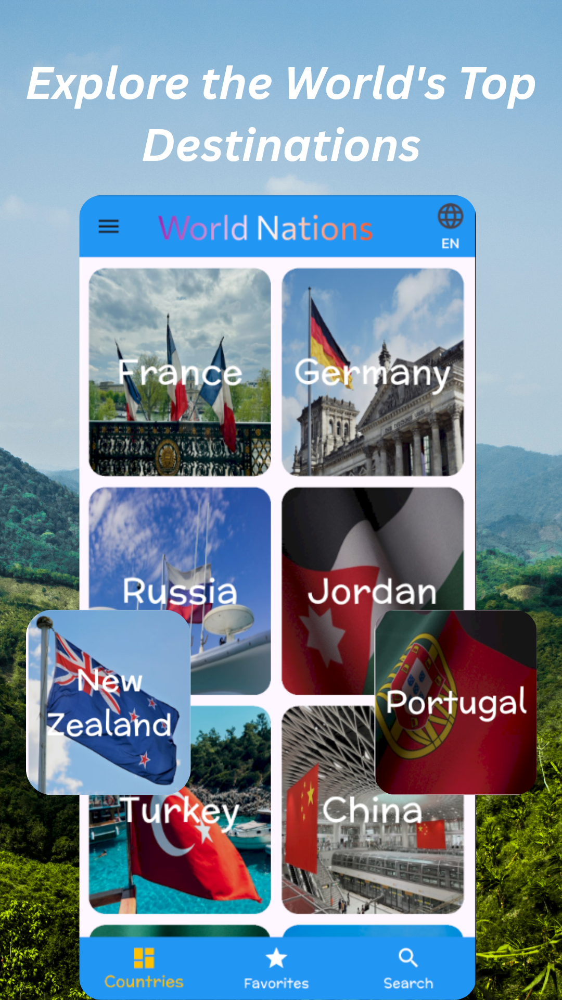
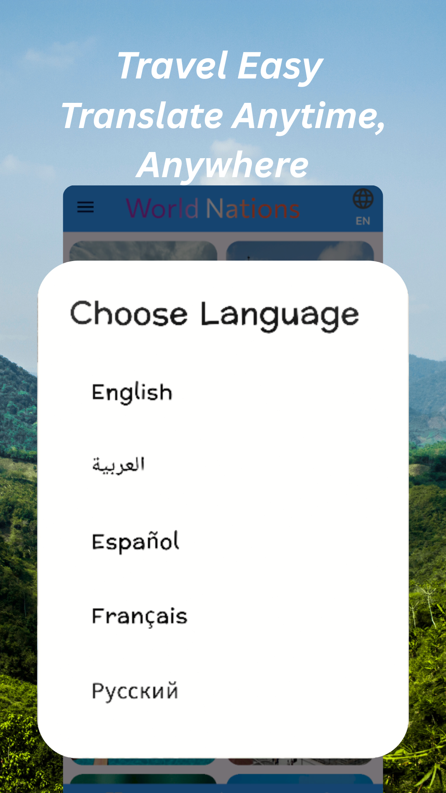
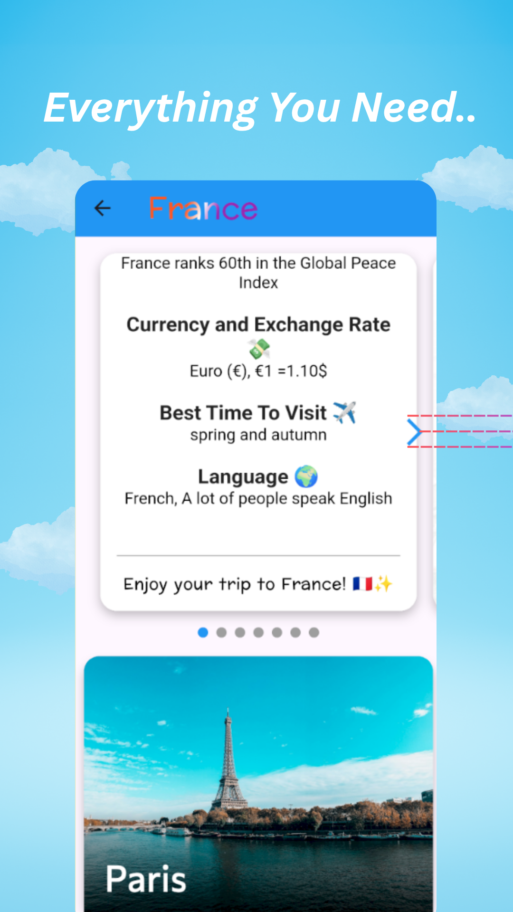
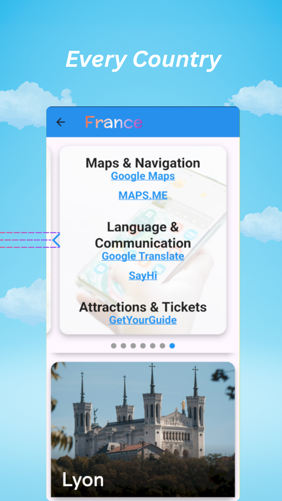
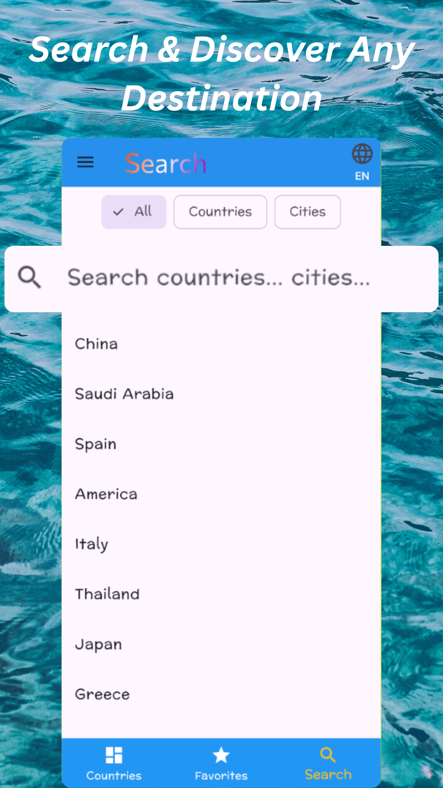
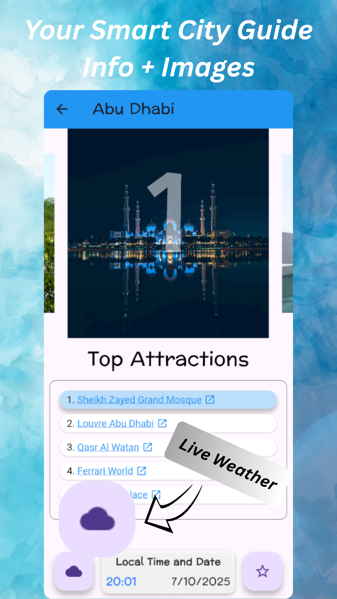
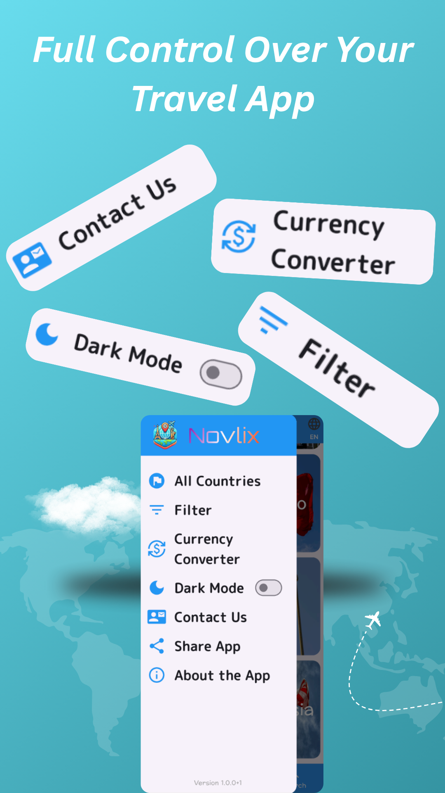

# 🌍 Novlix - Tourism Mobile App

A modern tourism mobile application built with Flutter and published on Google Play.

## 🚀 Features
- Discover tourist destinations
- View detailed information about places
- Search and filter locations
- Clean and user-friendly UI
- Real mobile app published on Google Play

## 🛠️ Technologies
- Flutter
- Dart
- REST API / Firebase 

## 📱 Screenshots

  
  
  

  
  
  

  
  

## 📦 Download
👉 Available on Google Play:  
[https://play.google.com/store/apps/details?id=com.harraqa.novlix]

## 🎯 Purpose
This project was developed to demonstrate my skills in:
- Mobile application development
- UI/UX design
- Flutter framework
- Publishing apps on Google Play

## 👩‍💻 Author
Harraqa Iead
